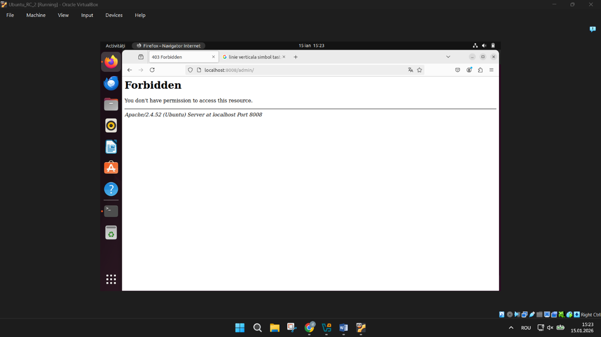
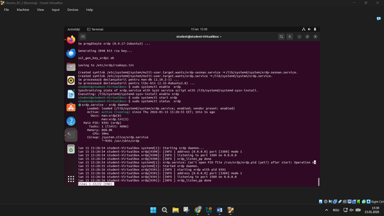
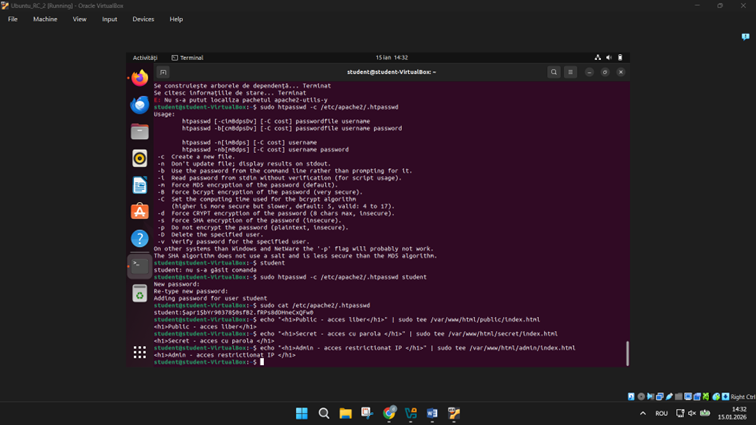
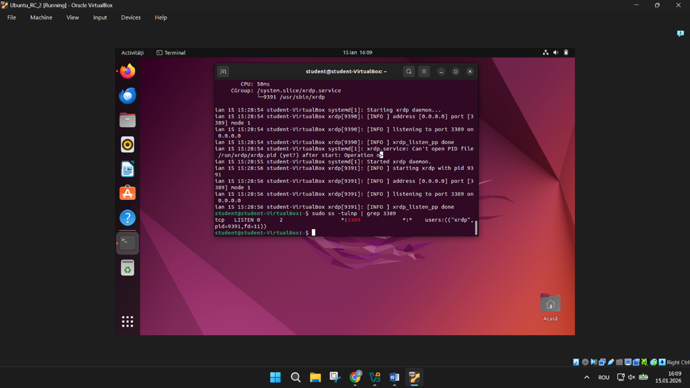

# 🔐 Apache Secured Server + XRDP Remote Access

## 📌 Overview

This project demonstrates the deployment and hardening of an Apache web server on Ubuntu, combined with remote desktop access using XRDP.

The configuration focuses on practical system administration tasks:

* custom port configuration
* access restriction
* user authentication
* remote system access

The setup was implemented and tested in a virtual machine environment.

---

## 🧰 Tech Stack

* Ubuntu Linux
* Apache2
* XRDP
* Bash (CLI)
* Networking fundamentals (IP, routing)

---

## ⚙️ Key Features

### 🔹 Apache Configuration

* Server running on custom port `8008`
* VirtualHost configuration
* Custom document root

### 🔹 Security Implementation

* Restricted directory (`/admin`)
* Basic authentication using `.htpasswd`
* Permission-based access control (403 handling)

### 🔹 Remote Access (XRDP)

* XRDP service installed and enabled
* Remote desktop session working

### 🔹 Networking

* IP configuration verification
* Routing table inspection

---

## 📁 Project Structure

```
.
├── screenshots/
│   ├── apache_service_running.png
│   ├── apache_ports_8008.png
│   ├── apache_default_page.png
│   ├── apache_403_forbidden.png
│   ├── apache_virtualhost_auth.png
│   ├── htpasswd_creation.png
│   ├── web_directories_created.png
│   └── xrdp_running.png
└── README.md
```

---

## 📸 Screenshots

### Apache Setup


---

### Security & Access Control






---

### XRDP Remote Access



---

## 🧪 Setup (Minimal Steps)

### Install Apache

```bash
sudo apt update
sudo apt install apache2
```

### Change Port

Edit:

```
/etc/apache2/ports.conf
```

Set:

```
Listen 8008
```

---

### Configure VirtualHost

```
/etc/apache2/sites-available/000-default.conf
```

---

### Enable Authentication

```bash
sudo apt install apache2-utils
sudo htpasswd -c /etc/apache2/.htpasswd student
```

---

### Restart Service

```bash
sudo systemctl restart apache2
```

---

### Install XRDP

```bash
sudo apt install xrdp
sudo systemctl enable xrdp
sudo systemctl start xrdp
```

---

## 📊 Results

* Apache runs on non-standard port ✔
* Restricted access works correctly ✔
* Authentication enforced ✔
* XRDP connection functional ✔

---

## 🎯 Purpose

This project demonstrates hands-on skills relevant for:

* Linux system administration
* DevOps internships
* Infrastructure/backend roles

---

## 👤 Author

**Marius Zaharia Andronic**
Computer Dual Engineering Student
