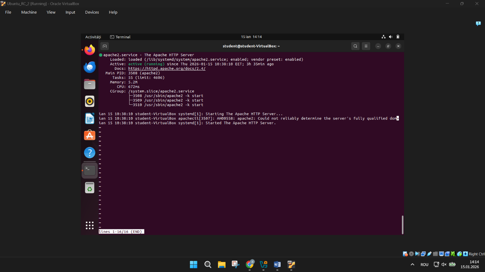
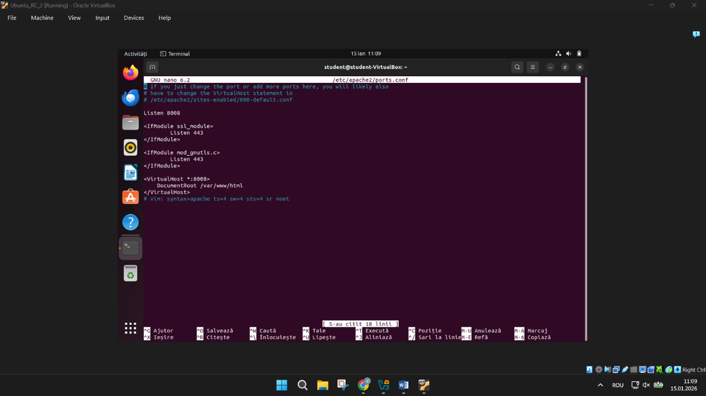

# SOHO LAN Security and Remote Services

## Overview
This project demonstrates the implementation of a SOHO network in a virtualized environment, including a web server and remote desktop access.

## Main Components
- Ubuntu 22.04
- VirtualBox NAT and Host-Only adapters
- Apache2 on port 8008
- XRDP on port 3389

## Implemented Features
- public web directory
- protected directory with Basic authentication
- admin directory restricted by IP
- remote desktop access from Windows

## Validation
- Apache service verified
- listening ports verified
- authentication tested
- RDP connection tested successfully

## Repository Structure
- `docs/`
- `screenshots/`
- `configs/`
- `scripts/`
## Screenshots

### Apache running

### Apache port 8008

### Authentication

### Access denied (403)

### XRDP connection

## Notes
This repository contains the implementation report and supporting configuration examples.

## Author
Student: Marius Zaharia Andronic
Facultatea: Fiesc Calculatoare – dual
